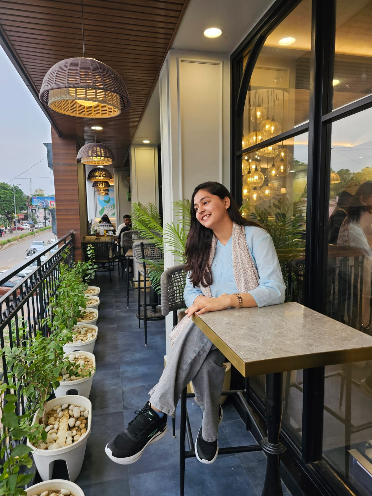

<div align="center">
  
  
  <h1>🌟 Kulsum Malik — Interactive Portfolio 🌟</h1>
  <p><strong>A Next-Generation Developer Portfolio built with cutting-edge Web Aesthetics.</strong></p>
  
  <p>
    <a href="https://github.com/stackpilotkulsum/Kulsum.dev">View Repository</a> •
    <a href="#features">Explore Features</a> •
    <a href="#tech-stack">Tech Stack</a>
  </p>
</div>

<hr/>

## ✨ About the Project

Welcome to my personal developer portfolio! This isn't just a static resume—it's an interactive, visually stunning web experience designed to showcase my skills, projects, and creative potential. I've engineered this portfolio to be responsive, engaging, and heavily focused on **Premium UI/UX** principles.

## 🚀 Advanced & Unique Features

My portfolio stands out by utilizing modern web design concepts, bringing the UI to life:

- **🔮 Dynamic Glassmorphism**: Semi-transparent, frosted-glass effects on navigation and cards, providing a sleek, layered depth.
- **🎨 Vibrant Dark Mode Aesthetics**: Carefully curated HSL color palettes featuring deep dark backgrounds (`#0d0d0e`) contrasted with striking neon accents (`#c8f55a`, `#7ee8b5`).
- **✨ Micro-Animations & Hover Effects**: Silky smooth transitions, lifting cards, and interactive buttons that react to user input, making the interface feel alive.
- **🪄 Floating Avatar Assistant**: A custom moving cartoon assistant that follows your journey across the site.
- **🖼️ Noise Texture Overlays**: Subtle SVG noise layers applied over the background to give the design a premium, tactile, and modern "brutalist-chic" feel.
- **📱 Fluid Typography & Responsive Grid**: Seamlessly scales from the largest 4K monitors down to mobile devices without compromising layout integrity.

## 📁 Repository Structure

```text
KULSUMPORFOLIO/
├── assets/                  # 🖼️ High-res images, avatars, and background assets
│   ├── about-bg.png
│   ├── contact-bg.png
│   ├── hero-bg.png
│   ├── kulsum.jpeg          # Profile picture
│   ├── projects-bg.png
│   └── skills-bg.png
├── index.html               # 🌐 Main portfolio interface (V1)
├── kulsum-malik-portfolio.html # 🚀 Advanced portfolio interface (V2)
└── README.md                # 📖 Project documentation
```

## 💻 Tech Stack

- **HTML5**: Semantic, accessible structure.
- **CSS3**: Advanced features like Grid, Flexbox, custom properties (CSS variables), `backdrop-filter`, and keyframe animations.
- **JavaScript (Vanilla)**: For handling interactive elements, floating avatars, and smooth scrolling without the overhead of heavy frameworks.

## ⚙️ Quick Start

Want to view the code or run it locally? It's as simple as it gets—no build tools or massive `node_modules` required.

1. **Clone the repo**:
   ```bash
   git clone https://github.com/stackpilotkulsum/Kulsum.dev.git
   ```
2. **Open it up**:
   Simply open `kulsum-malik-portfolio.html` directly in your favorite web browser!

---

<div align="center">
  <p>Built with ❤️ by <b>Kulsum Malik</b></p>
</div>
